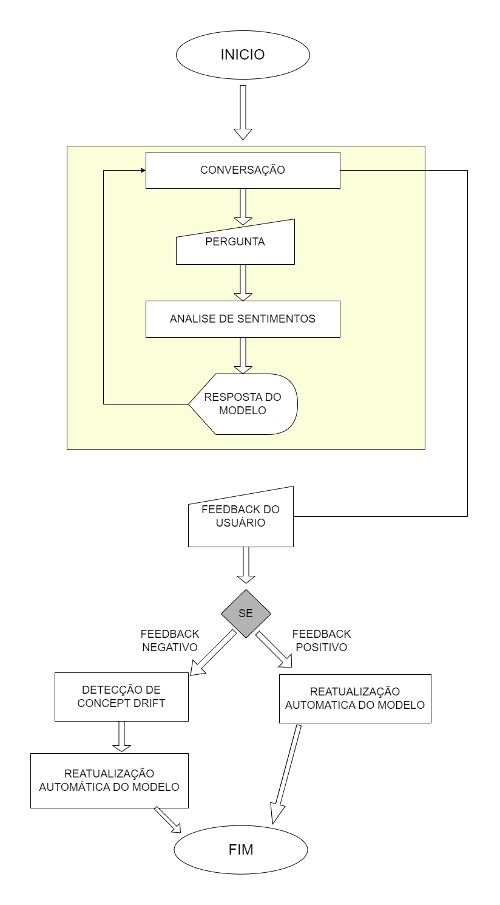

# Proposta de solução de aprendizado contínuo num sistema conversacional.

# Introdução: 

Os sistemas conversacionais, muitas vezes alimentados por modelos de linguagem e aprendizado de máquina, enfrentam um desafio contínuo e premente relacionado à manutenção da relevância ao longo do tempo. A falta de atualização regular dos modelos é um obstáculo significativo, levando a uma deterioração progressiva da eficácia do sistema. Este problema é agravado pela presença do conceito de "concept drift", que refere-se refere-se a um fenômeno em que as características ou distribuição dos dados em um determinado sistema mudam ao longo do tempo. Esse conceito é particularmente relevante em contextos nos quais modelos de aprendizado de máquina foram treinados para tomar decisões ou realizar previsões com base em dados históricos, mas as condições subjacentes mudam de maneira significativa.
Em outras palavras, o concept drift ocorre quando as relações entre as variáveis do problema mudam ao longo do tempo, tornando os modelos inicialmente treinados menos eficazes. Isso pode levar a uma degradação no desempenho do modelo, pois ele pode não mais refletir adequadamente a realidade dos dados recentes. A evolução constante nas preferências dos usuários, mudanças nas tendências linguísticas e a dinâmica intrínseca das interações humanas contribuem para o concept drift em sistemas conversacionais. O conceito drift pode se manifestar de diversas maneiras, desde a introdução de novos termos e gírias até mudanças nas expectativas dos usuários em relação à abordagem e tom da conversa. A falta de atualização desses modelos pode resultar em respostas desatualizadas, imprecisas e, em última instância, insatisfatórias para os usuários.
Neste contexto, torna-se imperativo implementar uma solução que promova o aprendizado contínuo do sistema conversacional.

# Solução Proposta:

## Diagrama de Blocos:

Fluxo do diagrama: Após o inicio do sistema, o usuário vai iniciar uma conversação. Esse processo de conversação consiste no usuário fazer uma pergunta, o sistema detecta os sentimentos e responde o usuário. Esse processo acontece em looping até o usuario finalizar a conversa. Após finalização da conversa o usuário poderá dar feedback de como foi a conversa. Se esse feeback fornecido for positivo, o modelo será retreinado com os dados coletados da conversa. Se o feedback for negativo, o sistema começará o processo de detecção de "concept drift" para detectar possíveis alterações no processo de interação com o usuário. Após isso, o modelo será retreinado com os dados que o usuário forneceu durante a conversa, levando em consideração o resultado da detecção de concept drift.

## Descrição Textual dos Blocos:

1. Conversação / Coleta de Dados:

  - Responsabilidade: Capturar interações do usuário, incluindo perguntas e respostas.
  - Método: Monitorar a conversa em tempo real e armazenar dados relevantes para análise.

2. Análise de Sentimento:

  - Responsabilidade: Avaliar a satisfação do usuário e identificar mudanças nas preferências.
  - Método: Utilizar análise de sentimento para entender a reação emocional do usuário em relação às respostas do sistema.

3. Feedback Humano:

  - Responsabilidade: Coletar feedback explícito do usuário sobre a eficácia das respostas.
  - Método: Incorporar botões de feedback ou solicitar avaliações para ajuste de desempenho.

4. Detecção de Concept Drift:

  - Responsabilidade: Identificar alterações significativas no padrão de interações.
  - Método: Utilizar algoritmos de detecção de concept drift para sinalizar a necessidade de reavaliação do modelo.

5. Reatualização Automática do Modelo:

  - Responsabilidade: Atualizar o modelo de conversação com base nas alterações identificadas.
  - Método: Implementar um sistema de retreinamento automático que integre novos dados e adapte o modelo conforme necessário.

# Conclusão:

A proposta de implementar aprendizado contínuo em sistemas conversacionais visa superar os desafios associados à falta de atualização de modelos, especialmente em face do concept drift. Embora exija um esforço significativo, os benefícios a longo prazo incluem a melhoria contínua da precisão das respostas e a capacidade do sistema de se adaptar dinamicamente às mudanças nas preferências dos usuários.

# Referências Bibliográficas:

1. Gama, J., Sebastião, R., & Rodrigues, P. (2014). Issues in evaluation of stream learning algorithms. Data Mining and Knowledge Discovery, 28(3), 677-714.

2. Ruder, S. (2017). An overview of gradient descent optimization algorithms. arXiv preprint arXiv:1609.04747.

3. Bertan, E. (04/09/2019). O que é concept drift em machine learning. Recuperado de https://medium.com/@ericabertan/o-que-%C3%A9-concept-drift-em-machine-learning-40ae3c4f0b67

4. Nobre, L. (01/11/2023). Concept Drift em Aprendizado de Máquina: Uma Introdução. Recuperado de https://dev.to/nobrelucas/concept-drift-em-aprendizado-de-maquina-uma-introducao-46pf
